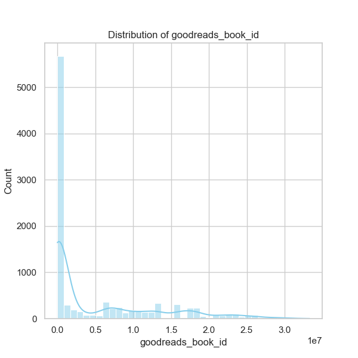

The data analysis results from the `goodreads.csv` file provide a broad overview of 10,000 book entries from the Goodreads platform. This dataset includes various attributes like book IDs, authors, publication years, ratings, and more. Here's a detailed narrative based on the provided statistics, correlations, and missing values.

### Summary Insights

1. **General Overview**:
    - The dataset consists of 10,000 books, with all key fields having no missing values except for ISBN-related and some title fields. The absence of these values needs consideration, especially in fields like `isbn` (700 missing) and `original_title` (585 missing), as they may limit the ability to connect with certain book editions or formats.

2. **Publication Trends**:
    - The mean original publication year is around 1981, with a significant spread (standard deviation of 152.57), ranging from as early as 1750 to 2017. This suggests a diverse mixture of modern and classic literature. A deeper dive into publication year trends could reveal peaks in popular genres or authors over the decades.

3. **Author Popularity**:
    - The data highlights a total of 4,664 unique authors, with Stephen King being the most prominent (60 entries). Analyzing the distribution of book counts by author can help uncover trends in author productivity and popularity.

4. **Ratings Analysis**:
    - The average rating across all books is very positive at approximately 4.00 (on a 5-point scale), with a standard deviation of 0.25. This indicates a general trend toward favorable responses among readers. Notably, 1-star ratings show a high standard deviation (6,635), suggesting a minority of books receive a significant number of negative reviews, possibly pointing to polarizing titles.

5. **Ratings Count and Work Reviews**:
    - The `ratings_count` averages about 54,001 with a maximum of nearly 4.8 million. There is a strong correlation (0.995) between `ratings_count` and `work_ratings_count`, indicating that books with more ratings often receive higher overall scores and more reviews. This could guide future marketing and outreach efforts for lesser-known titles that may benefit from more visibility.

### Outliers and Anomalies

1. **Books with High Ratings Count**:
    - The extreme maximum values in `ratings_count` (4,780,653) and `work_ratings_count` (4,942,365) indicate highly popular books, likely mainstream bestsellers. Notably, lower-rated books with high counts could suggest quality discussions around market trends or cultural phenomena that influence their popularity.

2. **Unusual Ratings Distribution**:
    - Notably, while the average is high, the data reveals that a substantial number of books receive 1-star and 2-star ratings, which could mean the presence of “so-bad-it's-good” books or specific titles that polarize opinion. Further investigation into the titles of these books and user reviews could yield interesting findings.

### Suggested Further Analyses

1. **Clustering Analysis**:
    - Implement clustering techniques (e.g., K-means or hierarchical clustering) to identify different groups of books based on their features (ratings, publication year, and author). This could help in segmenting books into categories like classics, modern bestsellers, niche genres, etc.

2. **Anomaly Detection**:
    - Use techniques such as Isolation Forest or DBSCAN to identify books that are significantly different in their ratings or authorship patterns. This could help to find hidden gems or predict potential future bestsellers based on initial user ratings.

3. **Sentiment Analysis on Reviews**:
    - By extracting and analyzing the text of user reviews associated with books, a sentiment analysis could reveal deeper insights into what readers love or dislike about different books.

4. **Trend Analysis Over Time**:
    - Analyze how the characteristics of books (like average ratings and author popularity) have evolved over the decades. This can guide publishers in targeting new authors, as well as understanding shifts in reader preferences.

### Impact on Future Decisions

The insights derived from the analysis can drive several strategic decisions in publishing and marketing:

- **Marketing Strategy Construction**: Understanding which genres and authors are currently trending can guide targeted marketing efforts.
- **Content Development**: Insights on reader preferences and popular themes can help publishers select which types of content to focus on in the future.
- **Inventory Management**: Identifying books that might generate seasonal demand based on previous trends can optimize inventory levels.

Overall, the analysis of the `goodreads.csv` dataset reveals valuable insights and trends that could shape future publishing strategies, reader engagement efforts, and content curation practices.

