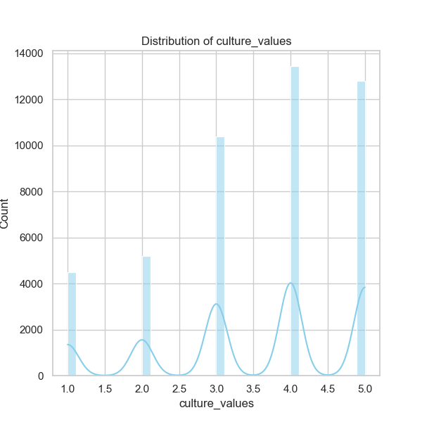
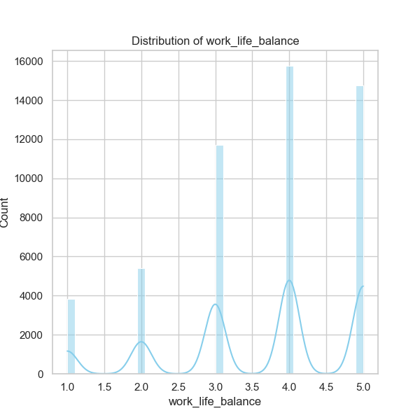

### Narrative Based on Data Analysis Results for 'dataset.csv'

#### Overview of the Dataset
The dataset contains employee reviews from 60,436 entries for a single firm, IBM. The reviews cover a wide range of aspects related to employee experience, including overall ratings, work-life balance, culture values, diversity inclusion, career opportunities, compensation and benefits, senior management evaluation, and various opinions such as pros and cons.

#### Summary Statistics
- **Overall Rating**: The average overall rating is approximately 3.52 on a scale of 1 to 5, which indicates a moderately positive perception among employees. The standard deviation of 1.12 suggests variability in employee experiences.
- **Work-Life Balance**: Rated at an average of 3.63, employees value their work-life balance positively. Ratings range from 1 (poor) to 5 (excellent). This is complemented by a standard deviation of 1.21, suggesting a diverse range of opinions.
- **Cultural Values & Diversity**: The overall culture values average rating is 3.54, while diversity and inclusion received a notably higher mean score of 4.19 despite having a significant amount of missing data. This may indicate that organizations having better results in diversity efforts tend to receive favorable ratings from employees.
- **Career Opportunities**: With an average score of 3.40, there may be room for development. Employees feel fairly positive but still see potential areas for improvement.
- **Compensation & Benefits**: This category received the lowest rating at 3.09, which could signal employee dissatisfaction if not addressed.
  
#### Missing Values
A significant issue arises with missing data, especially in categories like diversity inclusion (51,544 missing entries), which could skew the interpretation of this variable's importance. It is essential to assess why these values are missing and consider methods for imputation based on complete records to enhance analysis.

#### Correlation Insights
The correlation matrix indicates robust relationships among various factors:
- **Overall Rating & Culture**: There is a strong correlation (0.73) between overall rating and culture values, suggesting that companies with a more positive culture tend to have higher employee satisfaction.
- **Diversity and Inclusion**: Although highly regarded in isolation, its correlation with overall ratings (0.58) suggests its potential influence on employee satisfaction, deserving further exploration into how this element affects other ratings.

#### Trends and Patterns
1. **Shift in Ratings Over Time**: Given that the top review date is '17-12-2020' with 590 occurrences, an examination of time-series trends as it relates to sentiments could be insightful, particularly before and after significant corporate changes or major world events (e.g., Covid-19 pandemic).
  
2. **Job Titles & Ratings Influence**: The job title "Anonymous Employee" appears frequently with 12,860 instances. Analyzing the breakdown of ratings by job title could uncover if higher-ranking employees are rating differently compared to entry-level staff, thereby assessing hidden organizational layers.

3. **Geographic Variation**: The top location 'Bangalore' with 6,664 reviews—more than a tenth of the total dataset—suggests regional differences in employee sentiment should be examined to spot patterns in perceptions, such as distinctions between domestic (e.g., India) and international employee experiences.

#### Outliers and Anomalies
- The diversity inclusion score of 4.19 amidst missing data raises questions—are those responding with a high regard more inclined towards diversity and inclusion, thus inflating perceptions?
- Employee benefits scoring lower than all other metrics may indicate potential employee churn, which could negatively affect IBM's talent retention strategies.

### Recommendations for Further Analysis
1. **Clustering Analysis**: This technique could help identify distinct employee segments based on their reviews, allowing targeted strategies to improve employee satisfaction in lagging areas.
  
2. **Anomaly Detection**: Apply techniques to identify unusual patterns or outlier reviews to gauge extreme opinions that might require immediate management attention.

3. **Sentiment Analysis**: This could be particularly fruitful on textual variables like 'pros' and 'cons' to ascertain common themes or sentiments that affect overall employee satisfaction.

4. **Time Series Analysis**: Investigate how overall ratings and individual component scores fluctuate over time to identify emerging trends or causal events.

5. **Construct Predictive Models**: Creating models using correlation coefficients could help IBM predict overall satisfaction based on core aspects to understand which dimensions most affect employee retention and morale.

### Future Implications
Understanding these insights could help IBM drive strategic initiatives to enhance employee satisfaction, leading to improved recruitment and retention. by prioritizing high-impact areas (like compensation and diversity). This could result in creating a workplace that not only retains talent but also promotes a healthy and positive culture geared for long-term success.

