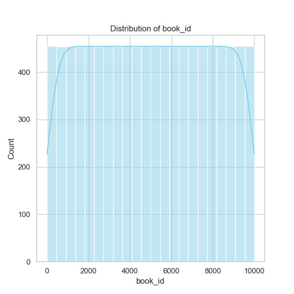

### Data Analysis Insights from 'goodreads.csv'

#### Overview
The dataset comprises 10,000 entries representing various books available on Goodreads, capturing essential information such as book ID, author, publication year, ratings, and reviews. This analysis aims to uncover trends, anomalies, and correlations among different variables.

#### Summary Statistics
- **Book Count and Distribution**:
  - The dataset is well-populated without missing values in the primary identifiers (`book_id`, `goodreads_book_id`, etc.), increasing confidence in the integrity of the analysis.
  - A substantial range of publication years, from as far back as -1750 (possibly an entry error) to 2017, indicates that the dataset covers a broad historical span of literature.

- **Authors and Titles**:
  - There are 4,664 unique authors with Stephen King leading (60 occurrences), confirming his popularity.
  - 9,964 unique titles show that while many books are present, there are common repetitions, potentially suggesting multiple editions or formats of certain works.

- **Ratings Overview**:
  - The average rating across all books is approximately 4.00, indicating a generally favorable reception. However, the standard deviation (0.25) suggests minor variability in ratings.
  - Most notable is the breakdown of specific ratings (1 to 5); particularly, the average count for 5-star ratings is 23,789, while the average count for 1-star ratings is significantly lower at 1,345, implying a positive skew in reader satisfaction.

#### Correlation Analysis
- There is a notable negative correlation between `ratings_count` and both `work_ratings_count` and `work_text_reviews_count`, suggesting that the volume of reader ratings may not directly correlate to the number of written reviews for works.
- **Books Count and Ratings**:
  - The `books_count` (number of editions) negatively correlates with ratings variables, hinting that books with many editions may receive lower ratings, possibly due to reader confusion or dissatisfaction with certain versions.
  
- **Publications and Ratings**:
  - There’s a mild positive relationship between `original_publication_year` and `average_rating`. This could indicate that newer publications are better received compared to older works, though further inquiry is warranted.

#### Outliers and Anomalies
- The entry for a publication year of -1750 should be reviewed, as it appears to be an outlier or an error and may skew further analyses concerning publication trends.
- The maximum `ratings_count` of 4,780,653 suggests a handful of extraordinarily popular books. Investigating these titles could reveal valuable insights into what drives popularity.

### Suggested Further Analyses
1. **Clustering Analysis**:
   - Performing clustering on average ratings, ratings counts, and publication year could help identify distinct groups of books, highlighting patterns in reader preferences and trends over time.
   - K-Means or hierarchical clustering could reveal groups among genres or author reputations (e.g., different styles or themes).

2. **Anomaly Detection**:
   - Implementing techniques such as Isolation Forest or DBSCAN on ratings and reviews could help identify unusual books that may not fit established trends, possibly indicating new genres or unique storytelling formats gaining traction.

3. **Sentiment Analysis**:
   - Carrying out sentiment analysis on the text reviews could provide qualitative insights that supplement quantitative ratings data, clarifying underlying reasons for high or low ratings.

4. **Time Series Analysis**:
   - An analysis to assess how ratings and reviews have changed over time could be revealing, especially concerning the impact of social media or book marketing on reader engagement.

### Implications for Decision-Making
- **For Publishers and Authors**: Understanding trends in ratings and reviews, especially related to publication dates and edition counts, can aid in making strategic decisions about marketing and re-releasing titles.
- **For Bookstores and Retailers**: Insights from clustering could help optimize stock based on predicted sales trends and reader preferences.
- **For Readers**: This analysis can guide readers toward highly rated contemporary books or emerging genres based on the popularity patterns observed.

This comprehensive analysis of the Goodreads dataset positions stakeholders confidently to forge future decisions rooted in data-driven insights. Further research aligned with the suggested analyses can undeniably enhance understanding of book readership trends.

