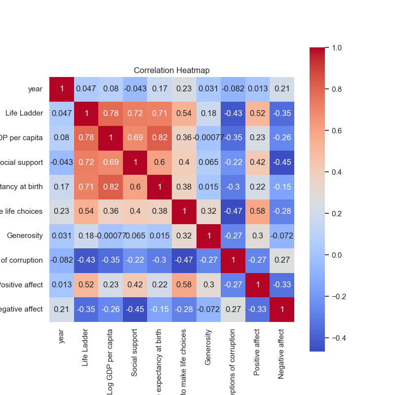
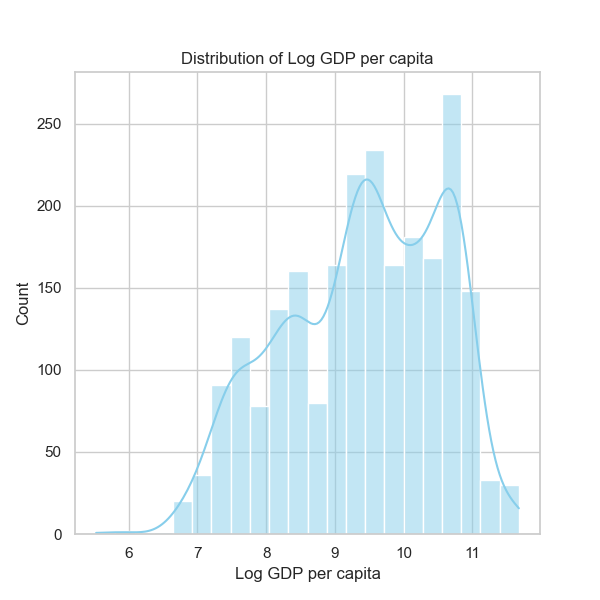

### Narrative on Happiness Data Analysis

The dataset 'happiness.csv' provides a comprehensive overview of various factors that influence happiness across different countries and over time, spanning from 2005 to 2023. The analysis focuses on key attributes such as the Life Ladder (a measure of subjective well-being), Log GDP per capita, social support, and psychological factors like positive and negative affect.

#### Summary Statistics

1. **Temporal Coverage and Trends**: 
   - The dataset encompasses information from 2005 to 2023, with a mean year of approximately 2014.76. This indicates a relatively balanced representation of data, though there is potential for significant changes post-2020, particularly considering global events such as the COVID-19 pandemic.

2. **Happiness Measures**: 
   - The average Life Ladder score is around 5.48, with a standard deviation of 1.13. This indicates a moderate level of perceived happiness, but the spread suggests considerable disparities among different countries.
   - The values for Log GDP per capita reveal reasonable economic variation (mean of approximately 9.40) highlighting potential economic drivers of happiness.
   - Social support (mean of 0.81) and freedom to make life choices (mean of 0.75) suggest that these factors play a significant role in contributing to overall well-being.

3. **Health Metrics**: 
   - The average healthy life expectancy is about 63.40 years. Given the high correlation between health and happiness, this figure indicates the importance of health outcomes in overall happiness.

#### Missing Values

Multiple columns have missing values, notably:
- **Healthy life expectancy** has 63 missing values,
- **Generosity** has 81 missing values.

The missing data could limit the depth of analysis for these attributes and may skew correlations if not appropriately addressed.

#### Correlation Insights

1. **Key Correlations**: 
   - There is a strong positive correlation between Life Ladder and Log GDP per capita (approximately 0.78) and social support (0.72). This suggests economic stability and community support are critical for enhancing happiness levels.
   - Freedom to make life choices shows a substantial correlation (0.54) with Life Ladder, indicating that personal agency contributes significantly to perceived happiness.
   - Conversely, perceptions of corruption negatively correlate with Life Ladder (-0.43), which may point to a decline in happiness in areas perceived as corrupt.

2. **Affective Components**: 
   - Positive affect has a substantial correlation (0.52) with Life Ladder, whereas negative affect shows a strong negative correlation (-0.35). This highlights that emotional well-being significantly ties to overall life satisfaction.

#### Outliers and Trends

1. **Outliers**: 
   - Outliers in the context of Life Ladder could represent countries with significantly higher or lower scores than the norm. Identifying these outliers can provide insights into what specific policies or social conditions contributed to their happiness levels.
   - Countries with exceptionally low or high GDP per capita should be examined to understand regional differences.

2. **Emerging Patterns**: 
   - There may be emerging patterns related to COVID-19 and mental health that warrant further scrutiny, especially when considering the years following 2020.

### Further Analyses

1. **Clustering**: 
   - Implement clustering techniques (like k-means or hierarchical clustering) to group countries based on happiness scores, GDP, social support, and health metrics. This could reveal natural groupings and patterns among countries, helping identify which factors are common within high- or low-happiness groups.

2. **Anomaly Detection**: 
   - Using anomaly detection algorithms would help identify countries that defy the general happiness trends based on their economic or social contexts. Understanding these anomalies could provide insights for policy-makers aiming to replicate successes or address significant issues.

3. **Longitudinal Analysis**: 
   - Conducting a time series analysis to see how the trends in happiness have changed over time and correlate these changes with significant global events (e.g., economic crises, pandemics).

### Implications for Future Decisions

The findings of this analysis can significantly influence policy decisions around welfare, health care, and economic strategies. Enhancements to social support systems and freedom of choice are likely to have a considerable impact on improving happiness standards. Countries may benefit from examining successful strategies employed by peers that rank higher on the Life Ladder, particularly in economic management and social cohesion. Furthermore, ongoing monitoring of these metrics will be essential in responding to changes and potential shifts in societal well-being, guiding interventions that promote happier, healthier populations.

