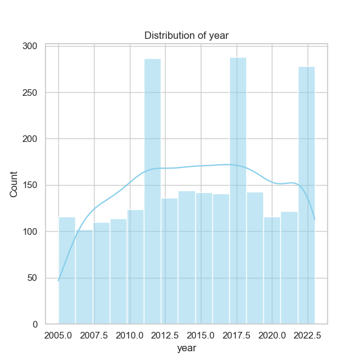

Based on the analysis of the dataset 'happiness.csv', a comprehensive examination has yielded several compelling insights concerning the factors influencing happiness across 165 countries from the years 2005 to 2023. The data offers a wide range of social, economic, and psychological metrics that contribute to individual well-being, measured predominantly by the "Life Ladder" score.

### Summary of Insights

1. **Overall Trends in Happiness**: 
   - The mean Life Ladder score is approximately 5.48, suggesting a moderate level of reported life satisfaction globally. The score ranges from a minimum of 1.281 to a maximum of 8.019, indicating a significant disparity in happiness among different countries.
   - Other factors related to happiness, such as "Log GDP per capita" (mean: 9.40), "Social support" (mean: 0.81), and "Healthy life expectancy at birth" (mean: 63.4 years), all contribute positively to the Life Ladder score, showing strong correlations (e.g., GDP per capita with a correlation of 0.78).

2. **Missing Data Patterns**: 
   - Several important columns like "Log GDP per capita," "Social support," and "Healthy life expectancy at birth" exhibit some missing values (28, 13, and 63 missing entries, respectively). Particularly concerning is the "Generosity" column, with 81 missing entries, which could bias analyses related to social behaviors and philanthropy.
   - The presence of missing data calls for careful handling and possible imputation techniques during further analysis to maintain the integrity of insights drawn from dependent variables.

3. **Correlation Insights**:
   - A notable negative correlation exists between "Life Ladder" and "Perceptions of corruption" (-0.43), implying that countries with higher perceptions of corruption tend to report lower life satisfaction.
   - Positive affect shows a significant correlation with "Life Ladder" (0.52), indicating that emotional states positively influence reported happiness levels, aligning with psychological literature.
   - The "Freedom to make life choices" and "Social support" also demonstrate strong correlations (0.54 and 0.72, respectively), suggesting that autonomy and community connections are critical to wellbeing.

4. **Outliers and Anomalies**:
   - Countries with extreme scores, both high and low, should be investigated. For instance, countries like Argentina show a high frequency (18 entries), but the variability in their Life Ladder scores may reveal divergent regional trends or responses to political/economic challenges.
   - Yearly trends show variance, particularly in the context of global events (such as the pandemic); further exploration is needed to identify how such external influences affect local happiness scores.

5. **Patterns**:
   - Countries with higher economic standings (reflected in GDP) generally display greater happiness, but significant partners like social support suggest that financial wealth alone does not guarantee happiness. 
   - The "Healthy life expectancy at birth" emerging as a strong predictor suggests that overall health statistics are crucial for understanding life quality and satisfaction.

### Suggested Further Analyses

To deepen our understanding of the complexities within the data, several advanced analyses could be considered:

1. **Clustering Analysis**:
   - Implementing clustering methods (like K-means or hierarchical clustering) could segment countries based on common characteristics (e.g., GDP, social support, corruption perception) and identify profiles for high liveability and happiness.
   - This would aid policymakers in understanding patterns and potentially adopting successful strategies from similar nations.

2. **Anomaly Detection**:
   - Investigate outlier scoring countries to identify what factors contribute to their anomalous Life Ladder scores, using methods like Isolation Forest or DBSCAN for detection.
   - Understanding these outliers can guide interventions or improvements targeted at regions where happiness is significantly detached from expected economic or health-related indicators.

3. **Time Series Analysis**:
   - Given the yearly data, time series analysis could be employed to identify trends and assess how happiness metrics evolve over time, especially through significant global or local events.

### Impact on Future Decisions

The implications of these analyses are substantial:

- **Policy Development**: Understanding the relative importance of various factors influencing happiness can streamline resource allocation toward social support, healthcare improvements, and minimizing corruption.
  
- **Healthcare Initiatives**: Increased emphasis on healthcare and improving life expectancy directly correlates with enhanced happiness indices, indicating that healthcare policy should remain a priority.
  
- **Social Programs**: Given the significant impact of social support on happiness, investments in community programs to bolster social networks could yield positive outcomes in national happiness statistics.

In conclusion, the analysis provides a multifaceted view of happiness across nations, demonstrating critical correlations and trends that shape individual well-being. By further investigating anomalies and employing advanced analytical techniques, stakeholders can better strategize interventions to enhance overall happiness in societies.

