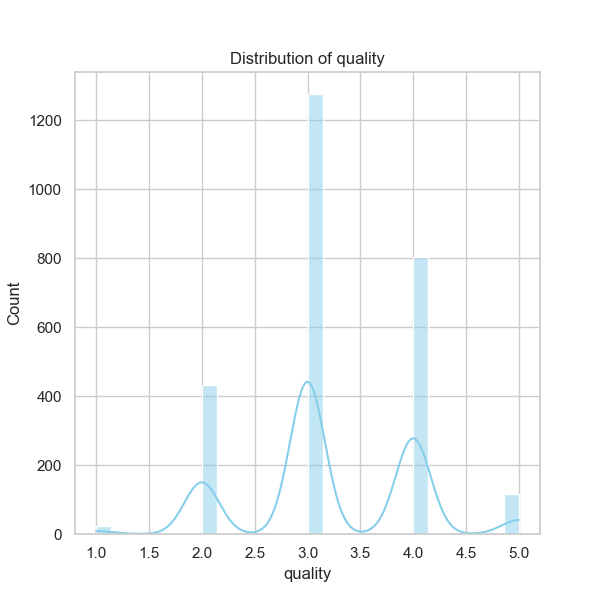

### Narrative Based on Media Data Analysis: 'media.csv'

#### **1. Overview of the Dataset**

The dataset `media.csv` comprises **2,652 entries** related to media titles, accompanied by attributes such as the **date** of release, **language**, **type** (e.g., movies or shows), **title**, **creator** (`by`), and ratings including **overall**, **quality**, and **repeatability**. The data shows variety in parameters with some entries containing missing values.

#### **2. Key Statistics**

- The **date** field reveals **2553 valid entries**, with **2055 unique dates**. The most frequently recorded date is '21-May-06', which appears **8 times**. This date may represent a significant release date or event warranting further investigation.
- The **language** field indicates a total of **11 unique languages**, with **English** being the predominant language (reported in **1306 entries**), suggesting a skew towards English-language media.
- The **type** of media is primarily **movies** (appearing **2211 times**), indicating the dataset's focus on cinematic entries.
- The **title** field has **2,312 unique titles**, with 'Kanda Naal Mudhal' being the most frequently recorded title, appearing **9 times**.
- The **by** field has **1,528 unique creators**, with **Kiefer Sutherland** leading the contributions in this dataset (noted **48 times**).
- The ratings present an overall mean score of **3.05** for **overall**, **3.21** for **quality**, and a mean of **1.49** for **repeatability**, indicating a mixed response from users, generally leaning towards moderate satisfaction.

#### **3. Missing Values**

The missing values are concentrated in:
- **Date**: 99 entries missing.
- **By**: 262 entries missing.
These gaps could skew the analysis and might require data imputation or careful consideration in future analyses.

#### **4. Correlation Insights**

The correlation matrix indicates the following:
- There is a strong positive correlation between **overall rating** and **quality rating** (0.83), suggesting that users who rate the media higher in quality tend also to rate it higher overall.
- A moderate positive correlation exists between **quality rating** and **repeatability** (0.31), but repeatability’s lower correlation with overall means that quality is a more significant indicator of audience satisfaction.
- The overall repeatability rating shows a moderate correlation with the overall rating (0.51). This implies that while repeatability does affect satisfaction, it is not as significant a factor as overall quality.

#### **5. Trends, Patterns, and Anomalies**

Emerging patterns include:
- The predominance of English media suggests an opportunity for exploration into non-English media, possibly expanding offerings to a broader audience.
- The strong interest in certain titles like 'Kanda Naal Mudhal' could indicate either a niche but passionate viewer base or a trend that merits deeper dives into viewer demographics.

#### **6. Suggestions for Further Analysis**

To derive greater insights and actionability from this dataset, consider the following analyses:
- **Clustering Analysis**: Group similar titles based on attributes like ratings, type, and language to identify potential audience segments. This could inform targeted marketing strategies or recommendations.
- **Time Series Analysis**: Investigate trends over time based on the date of release to better understand media consumption trends. Identify if certain languages or types gain popularity in specific time frames.
- **Anomaly Detection**: Identify outliers in overall ratings vs. quality ratings to understand unexpected viewer responses. For example, a media type scoring low overall but high quality may indicate market misalignment.
- **Market Response Analysis**: Explore how ratings affect one another across genres or languages. Understanding shifts in viewer preferences could aid in content acquisition or production decisions.

#### **7. Implications for Future Decisions**

Understanding these trends has crucial implications:
- **Content Strategy**: If clustering highlights demand for certain genres or languages, acquiring content aligned with these trends can cultivate a larger audience base.
- **Quality Focus**: The correlation highlights the necessity of maintaining quality; boosting quality assurance processes can help elevate overall ratings which, in turn, fosters viewer loyalty.
- **Diversity in Offerings**: By analyzing the popularity of non-English titles, strategies can be developed to diversify offerings, which may captivate underserved audiences.

In conclusion, the analysis of the `media.csv` dataset reveals critical trends and insights that hold the potential to significantly impact media content strategy, viewer engagement, and overall satisfaction. Further exploration and targeted analyses can enhance operational decision-making and audience cultivation efforts.

