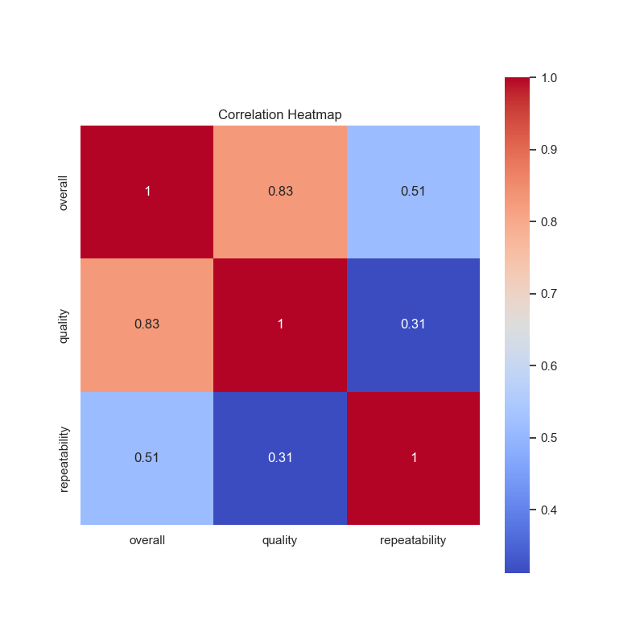

Based on the analysis of the dataset 'media.csv' containing 2652 entries with eight distinct columns, we can derive several insightful narratives regarding the trends, patterns, anomalies, and potential recommendations for further analyses.

### Summary of Data Composition

**Columns Overview:**
- **Date**: Records span across multiple years, with 2553 entries containing a date, indicating that some dates are missing.
- **Language**: The media is produced in 11 different languages, with English being the most common.
- **Type**: The predominant media type is 'movie' (2211 instances), suggesting a focus in the dataset.
- **Title**: A total of 2312 unique titles appear, with 'Kanda Naal Mudhal' being the most frequently cited title.
- **By**: Identifying creators is key, as there are notable contributors, where Kiefer Sutherland is the most frequent contributor.
- **Overall Ratings**: The average overall rating is approximately 3.05, indicating a generally favorable reception, but with a standard deviation that suggests there is variability in the audience's perception.
- **Quality Ratings**: The average quality rating is a bit higher at approximately 3.21, indicating a consensus on the quality among viewers.
- **Repeatability Ratings**: This score averages around 1.49, indicating that media is not frequently recommended for repeat viewing.

### Trends and Insights

1. **Language Distribution**:
   - With the majority of the entries being in English (around 49%), there is a significant leaning towards media created for an English-speaking audience. This trend suggests that if this dataset represents a broader market strategy, there may be an untapped potential to cater to non-English speakers or minority languages.

2. **Type Analysis**:
   - The overwhelming majority being movies more than other types of media indicates a niche focus. It could be strategic to consider diversification into different media types, like series or documentaries.

3. **Temporal Analysis**:
   - Notably, the most frequently seen date indicates there are peaks in media production on those dates. Analyzing media release dates could enable identifying seasonal trends which may inform future production cycles, marketing strategies, and launch window optimizations.

4. **Quality and Overall Rating Relationships**:
   - The correlation between the overall score and quality score is strong (0.826), indicating when quality ratings improve, overall ratings tend to improve as well. This positive correlation suggests that stakeholders should focus on improving quality as a means to enhance overall audience satisfaction.

5. **Repeatability Scores**:
   - With a mean score of just under 1.5, it indicates that viewers do not frequently engage in repeated viewings of the titles. This could point towards a need for higher production values or more captivating storylines to enhance re-watching potential.

### Potential Outliers

- The missing values (99 entries for date and 262 for 'by') could signify media that were either less popular or had gaps in attributes which should be investigated further.
- The title 'Kanda Naal Mudhal' with the highest occurrence (9 times) could be a significant media piece that warrants an analysis of its reception, production quality, and audience demographics.

### Further Analyses Recommendations

1. **Clustering Analysis**:
   - Performing a clustering analysis (e.g., K-means clustering) on ratings could help uncover hidden segments within the data. This analysis could yield insights into audience preferences and how different types of media relate to viewer satisfaction.

2. **Time Series Analysis**:
   - Conducting a time series analysis on date fields could reveal trends over time in specific types or languages of media. This may also highlight cyclical patterns in media consumption related to seasons or events.

3. **Anomaly Detection**:
   - Investigate outliers in ratings (i.e., very high or very low values) to understand any extreme viewer preferences and investigate if these associations might affect a future production.

4. **Sentiment Analysis**:
   - If viewer reviews or comments are available, performing a sentiment analysis could add qualitative dimensions to the quantitative ratings, providing context to data-driven conclusions.

### Implications for Future Decisions

Understanding these aspects can be crucial for strategic planning and marketing initiatives. Particularly, focusing on quality improvements will enhance overall ratings and repeat viewership, perhaps influencing content development timelines and budget allocations. Furthermore, a targeted approach towards marketing non-English media or diversifying media type offerings could exploit marketplace gaps and drive growth, potentially leading to greater audience engagement and satisfaction.

These analyses pave the way for data-driven decision-making, allowing for evidence-based revisions to current media production and marketing strategies, aiming to captivate and retain larger audiences.

